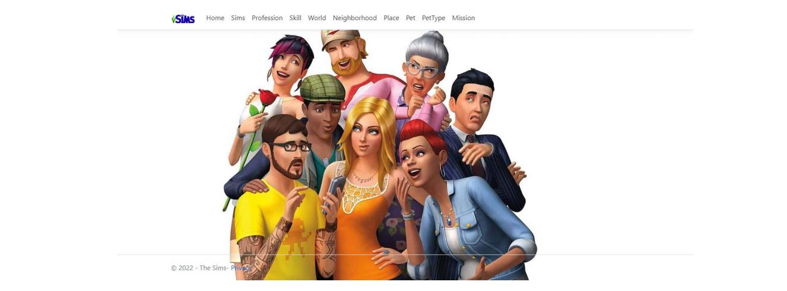

# The-Sims

## Authors:
Carlos Carret @Krtucho
Daniela Rodríguez @Daroce1012

## Database Systems Subject Project
### Keywords:
- C#
- SQL
- ASP.NET framework
- Web application
- Model-View-Controller
- N-Layered architecture
- Entity Framework
- HTML
- CSS

## Introduction 
In the following document, we will address the details that make up the problem that was given to us: The Sims. We will analyze the functional requirements presented by it, as well as the solution paths that were undertaken to resolve them. We will expand the information on the architecture used, the modules, and tools that we used for the implementation of our product. We will provide some images and descriptions of what the final product views would look like.

## Requirement Analysis 
The problem proposes us to model the entities that are part of it, as well as obtaining the relationships that take place between the different entities. Also, several queries and questions are wanted to be made, and that they are satisfactorily answered with the correct information. To solve it, a web application was created that implements a tool that manages CRUD to a database where all the Sims data, relationships between the entities of the problem, and the information that interests us are located.

## Proposed Solution 
The problem will be solved by creating a Web application that will be developed using the ASP.NET framework. We will use a client-server architecture, using the Model-View-Controller pattern on the server side, so it will be modeled with an N-Layered architecture of three main layers: presentation, processes, and data. The first layer we will use to get a view for the user to connect and interact with our application. This will be directly connected to the process layer. The latter will receive the information sent by the user and will access the data layer to perform queries and be able to send the user a correct response of what he is looking for. We think it is a good idea to carry out the development of this architecture because we will have three layers working independently, having in the middle of the presentation layer and the data layer, a layer that will be responsible for handling all the logic of our process and communicate both, trying to have greater robustness and integrity of the data and the visual part of our application.

### Results Obtained 

Main View

## Conclusions and Recommendations 
Throughout the realization of this project, we have expanded our knowledge about a branch of computer science that we still did not know, with this report it is intended to give an introduction and a general review of the work carried out so far. You can witness some of the functionalities it presents, both textually and visually. We believe it would not be a bad idea to delve even further into the topics related to web programming and applications that manage databases, this type of applications can be very useful in today's world and in the coming years. 

## More Details
For more details about the project, all the information can be found in the folder $\textbf{reports}$

[Academic Report](reports/Academic_Report.pdf)
[Technical Report](reports/Technical_Report.pdf)
[Second Report](reports/Report2.pdf)
[User Manual](reports/User_Manual.pdf)
